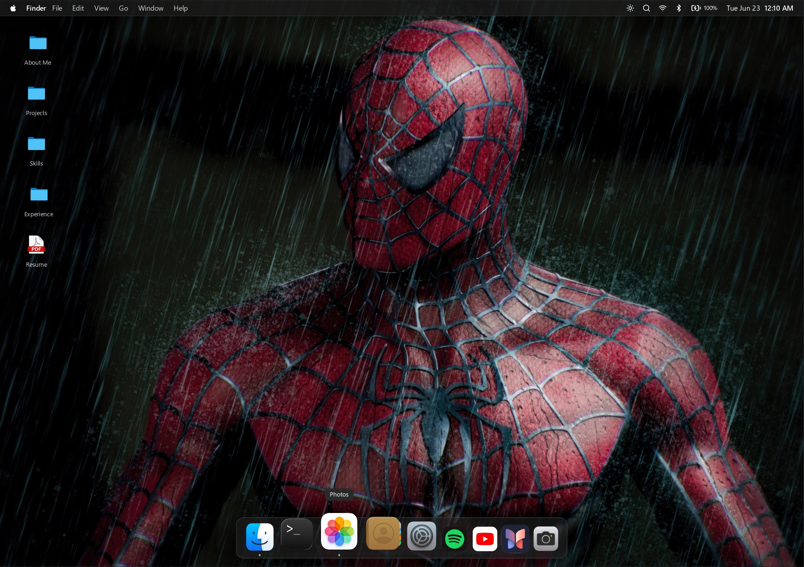

# macOS Portfolio

A professional, interactive portfolio experience inspired by macOS—built to showcase projects, skills, and personal branding in a desktop-like interface.

[](https://www.sudhanshukhosla.in/)
[](https://react.dev/)
[](https://www.typescriptlang.org/)
[](https://vitejs.dev/)

## Website Preview



## Highlights

- macOS-style desktop with Menu Bar, Dock, Spotlight, and Launchpad
- Multi-window interactions (open, focus, minimize, maximize, close)
- Responsive behavior for desktop, tablet, and mobile screens
- Built-in portfolio apps (About, Projects, Skills, Experience, Contact, Resume)
- Additional interactive apps (Terminal, Gallery, Camera, Spotify, YouTube, Journal)
- Light and dark appearance support with smooth UI transitions

## Tech Stack

- React + TypeScript
- Vite
- Tailwind CSS
- Framer Motion
- Radix UI components

## Getting Started

### 1) Clone the repository

```bash
git clone https://github.com/Sudhanshu-khosla-26/macos-portfolio.git
cd macos-portfolio
```

### 2) Install dependencies

```bash
npm install
```

### 3) Run the project locally

```bash
npm run dev
```

## Available Scripts

- `npm run dev` — start local development server
- `npm run build` — create production build
- `npm run lint` — run ESLint checks
- `npm run preview` — preview production build locally

## Project Structure

```text
src/
├── components/
│   ├── apps/        # Portfolio app windows
│   ├── Dock.tsx
│   ├── Desktop.tsx
│   ├── MenuBar.tsx
│   └── Window.tsx
├── hooks/           # UI and system behavior hooks
├── types/           # Shared TypeScript types
└── App.tsx          # Root app composition
```

## Author

**Sudhanshu Khosla**

- GitHub: https://github.com/Sudhanshu-khosla-26
- LinkedIn: https://www.linkedin.com/in/sudhanshu-khosla-a05b4a298/
- Email: work.sudhanshukhosla@gmail.com

## License

MIT License
